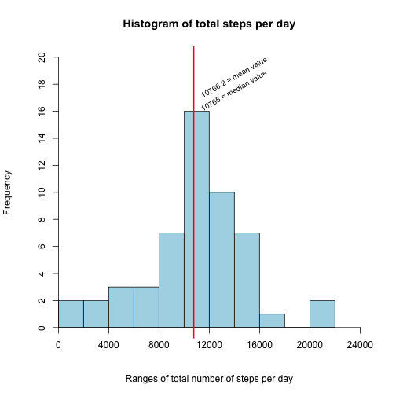
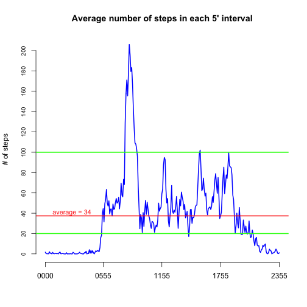
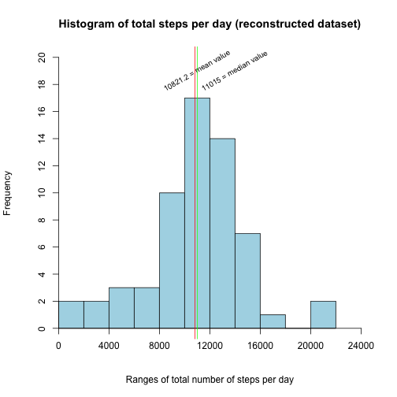
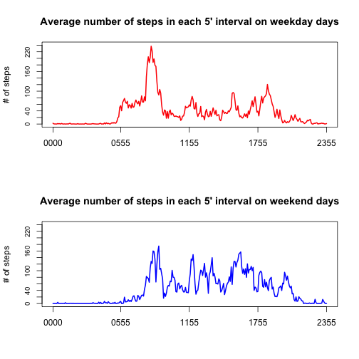

HOW MANY STEPS TAKEN ALONG TWO MONTHS !
======================
**_by Max Testa_**

This project analyses and shows some basic charactarestics of a dataset containing two months-long observations of the number of steps made and recorded every 5 minutes from 2012-10-01 to 2012-11-30.

This is the configuration of the system on which the analysis has been performed. 

```r
sessionInfo()
```

```
## R version 3.1.1 (2014-07-10)
## Platform: x86_64-apple-darwin10.8.0 (64-bit)
## 
## locale:
## [1] it_IT.UTF-8/it_IT.UTF-8/it_IT.UTF-8/C/en_US.UTF-8/it_IT.UTF-8
## 
## attached base packages:
## [1] stats     graphics  grDevices utils     datasets  methods   base     
## 
## other attached packages:
## [1] lattice_0.20-29 knitr_1.8      
## 
## loaded via a namespace (and not attached):
## [1] evaluate_0.5.5 formatR_1.0    grid_3.1.1     markdown_0.7.4
## [5] mime_0.2       stringr_0.6.2  tools_3.1.1
```


## Loading and preprocessing the data
The data file [repdata_data_activity.zip](https://d396qusza40orc.cloudfront.net/repdata%2Fdata%2Factivity.zip), dowloaded from the project site, has been  unzipped and is present as `activity.csv`` file in the working directory.

Data are read into a dataframe called `activity`, with the following structure:

```r
activity<-read.csv("activity.csv", header=TRUE, stringsAsFactor=FALSE)
str(activity)
```

```
## 'data.frame':	17568 obs. of  3 variables:
##  $ steps   : int  NA NA NA NA NA NA NA NA NA NA ...
##  $ date    : chr  "2012-10-01" "2012-10-01" "2012-10-01" "2012-10-01" ...
##  $ interval: int  0 5 10 15 20 25 30 35 40 45 ...
```

The variable `interval` is transformed into a `4 digit string` to make it more uniform and meaningful.
Variable `date` is coerced to class "Date", to make easier the handling of the days of the week and of weekday/weekend days.

```r
activity$interval<-sprintf("%04d", activity$interval) ## from 0000 to 2355
activity$date<-as.Date(activity$date)
```

Dataset principal caracteristics are as follows:

```r
summary(activity)
```

```
##      steps             date              interval        
##  Min.   :  0.00   Min.   :2012-10-01   Length:17568      
##  1st Qu.:  0.00   1st Qu.:2012-10-16   Class :character  
##  Median :  0.00   Median :2012-10-31   Mode  :character  
##  Mean   : 37.38   Mean   :2012-10-31                     
##  3rd Qu.: 12.00   3rd Qu.:2012-11-15                     
##  Max.   :806.00   Max.   :2012-11-30                     
##  NA's   :2304
```

It is noteworthy that the following days don't have any valid observations and
contain all the `2304 NAs` of the dataset:

```r
## only the dates with all their 12*24=288 values==NAs are considered
which.dates.with.NAs<-which(tapply(is.na(activity$step),activity$date, sum)==12*24)
print(paste(dates.with.NAs<-unique(activity$date)[which.dates.with.NAs], weekdays(dates.with.NAs), sep=" "))
```

```
## [1] "2012-10-01 Monday"    "2012-10-08 Monday"    "2012-11-01 Thursday" 
## [4] "2012-11-04 Sunday"    "2012-11-09 Friday"    "2012-11-10 Saturday" 
## [7] "2012-11-14 Wednesday" "2012-11-30 Friday"
```

The total number of steps per each day is computed and put into the new
dataframe `values.per.day`; this df will be used in the subsequent analysis.

```r
## 8 days with only NAs are excluded
values.per.day<-aggregate(steps ~ date, data=activity, sum, na.rm=TRUE)
## assigns a more proper name to the second variable
names(values.per.day)[2]<-"tot.steps"
```


## What is mean total number of steps taken per day?
The frequencies of the total number of steps per day are distributed as per the following histogram, that shows also a vertical line that corresponds to the close values of the median and of the mean of the total number of steps per day.

```r
hist(values.per.day$tot.steps, breaks=12, main="Histogram of total steps per day", xlim=c(0,24000),
     ylim = c(0,20), xlab="Ranges of total number of steps per day", axes=FALSE, col="lightblue")
axis(1,at = seq(0,24000,4000),labels = TRUE,pos = 0)
axis(2,at = seq(0,20,2),labels = TRUE,pos = 0)
mean.tot.steps<-round(mean(values.per.day$tot.steps),1) ## to be used in the plot and in the subsequent question
median.tot.steps<-median(values.per.day$tot.steps) ## to be used in the plot and in the subsequent question
abline(v=mean.tot.steps, col ="red", lwd=2)
text(paste(mean.tot.steps, " = mean value",sep=""),
     x=11500, y=17, adj=c(0,0), cex=0.8, srt=30)
text(paste(median.tot.steps, " = median value",sep=""),
     x=11500, y=16, adj=c(0,0), cex=0.8, srt=30)
```

 

As already shown in the above histogram the median = `10765` and the mean =  `10766.2` values of the total number of steps per day are very close to each other.


## What is the average daily activity pattern?

The number of steps in each 5'-interval is averaged across all days
(excluding those with NAs) and put into a new dataframe ``daily.pattern``.

```r
daily.pattern<-aggregate(steps ~ interval, data=activity, FUN="mean", na.rm=TRUE)
```

The ``daily.pattern`` is shown in the following line plot, whose x-axis refers to  the 5'-intervals from 0000 to 2355, of which only 5 are used as labels at regular space for sake of clarity.


```r
plot(daily.pattern$steps, type="l", lwd=2, main="Average number of steps in each 5' interval",
     xlab="", ylab="# of steps", col="blue", axes=FALSE)
axis(1, at=c(1, 6*12, 12*12, 18*12, 24*12),
     labels=daily.pattern$interval[c(1, 6*12, 12*12, 18*12, 24*12)])
axis(2, at=seq(0, 200, by=20), cex.axis=0.8)
## adds 3 horizontal lines at the level of: 5; 100; average number of steps taken in 5' interval
abline(h=20, col="green", lwd=2)
abline(h=100, col="green", lwd=2)
abline(h=mean(daily.pattern$steps), col="red", lwd=2)
text(paste("average = ", round(mean(daily.pattern$steps,1)), sep=""), x=10,
     y=round(mean(daily.pattern$steps,0))+2, adj=c(0,0), cex=0.9, col="red")
```

 


The 5'-interval with the maximum number of steps on average across all days is the one starting at 0835.

```r
## finds the interval with the maximum number of steps on average
daily.pattern[which.max(daily.pattern$step),]
```

```
##     interval    steps
## 104     0835 206.1698
```


As shown in the plot, on average the activity is very limited (below 5 steps per 5'-interval) from 0000 to 0530 and after 2235

```r
## identifies and shows the set of all the 5'-intervals with less than 5 steps
daily.pattern$interval[which(daily.pattern$steps<5)]
```

```
##  [1] "0000" "0005" "0010" "0015" "0020" "0025" "0030" "0035" "0040" "0045"
## [11] "0050" "0055" "0100" "0105" "0110" "0115" "0120" "0125" "0130" "0135"
## [21] "0140" "0145" "0150" "0155" "0200" "0205" "0210" "0215" "0220" "0225"
## [31] "0230" "0235" "0240" "0245" "0250" "0255" "0300" "0305" "0310" "0315"
## [41] "0320" "0325" "0330" "0335" "0340" "0345" "0350" "0355" "0400" "0405"
## [51] "0410" "0415" "0420" "0425" "0430" "0435" "0440" "0445" "0450" "0455"
## [61] "0500" "0505" "0510" "0515" "0520" "0525" "0530" "2155" "2200" "2205"
## [71] "2210" "2235" "2240" "2245" "2250" "2255" "2300" "2305" "2310" "2315"
## [81] "2320" "2325" "2330" "2335" "2340" "2345" "2350" "2355"
```
The activity increments significantly between 0535 and 0605 and even more from 0800 to 0835, when it reaches its maximum value; afterwards it goes under the average value and then oscillates between around 20 and 100 steps per 5'-interval until around 2100, when it starts a descending trend.


## Imputing missing values
The number of rows with missing values (NAs) is quite relevant, both in absolute terms (=`2304`) and in relative terms (=`13%`).

In order to impute the missing values of the 8 dates with NAs, for every day of the week the average number of steps in each 5'-interval is calculated and stored  in the columns of a new dataframe called ``DoW.avgs``; in this way the typical characteristics of each day of the week are kept.


```r
## as found at the beginning of the analysis, missing valued are concentrated
## only in some dates, that miss all their value; therefore it is sufficient to
## select the dates and work on them that are stored into a dataframe
uncomplete.dates<-data.frame(date=unique(activity$date[which(is.na(activity$step))]))
## associate the day-of-the-week (var DoW) to each element of "uncomplete.dates"
## df using the function weekdays()
uncomplete.dates<-cbind(uncomplete.dates, DoW=weekdays(uncomplete.dates$date))
## DoW.avgs (Days-of-Weeks.averages) contains in its first column the 288 5'-intervals and in each of the following 7 columns the 288 number of steps
## averaged across every day of the week, from Monday (col 2) to Sunday (col8)

## initizialize DoW.avgs with the var "interval" [0000 ... 2355] as first row
DoW.avgs<-data.frame(interval=unique(activity$interval))
dayofweek=c("Monday", "Tuesday", "Wednesday","Thursday","Friday", "Saturday", "Sunday")
## calculates and stores in DoW.avgs columns the average number of steps in each 5'-interval from "Monday" to "Sunday"  
for (i in 1:7){
  ## subsetting the activity dataset per day-of-the-week and eliminating the NAs
  data.ref<-cbind(subset(activity,
                         weekdays(date)==dayofweek[i]& !is.na(activity$steps)))
  ## calculates the average number of steps for each 5'-interval and
  ## stores it into as the (i+1)-th new column of DoW.avgs dataframe
  DoW.avgs<-cbind(DoW.avgs,
                  aggregate(steps ~ interval, data=data.ref, FUN="mean")[2])
}
## assigns significant names to DoW.avgs columns
names(DoW.avgs)=c("interval", paste("avg.step", dayofweek, sep="."))
```


The following table shows the median and the mean calculated across each day of the week:

```r
compare.values<-cbind(dayofweek,
                median.val=round(sapply(DoW.avgs[2:8], median),1),
                mean.val=round(sapply(DoW.avgs[2:8], mean),1))
rownames(compare.values)<-rep("", 7)
kable(compare.values, align = c("l", rep("r", 2)))
```


|   |dayofweek | median.val| mean.val|
|:--|:---------|----------:|--------:|
|   |Monday    |        8.2|     34.6|
|   |Tuesday   |       14.8|     31.1|
|   |Wednesday |       12.6|     40.9|
|   |Thursday  |        7.8|     28.5|
|   |Friday    |       15.5|     42.9|
|   |Saturday  |       16.4|     43.5|
|   |Sunday    |       23.9|     42.6|


A copy of the ``activity`` df is made into a new dataframe called ``compl.act``: its NAs values are substituted with the corresponding values of the relevant day of the week from ``DoW.avgs`` dataframe.


```r
compl.act<-activity
for(i in 1:dim(uncomplete.dates[1])[1]){
  compl.act$steps[compl.act$date==uncomplete.dates$date[i]]<-
      DoW.avgs[,which(dayofweek==uncomplete.dates$DoW[i])+1]
}
```


The total number of steps per each day - including the 8 with reconstructed
values - is computed and put into the new dataframe `compl.values.per.day`.

```r
compl.values.per.day<-aggregate(steps ~ date, data=compl.act, sum, na.rm=TRUE)
## associates a more proper name to the second variable
names(compl.values.per.day)[2]<-"tot.steps"
```

The frequencies of the total number of steps per day - including the 8 with imputed values - are distributed as per the following histogram, that shows also two vertical lines corresponding to the values of the median and of
the mean of the total number of steps per day.

```r
tit="Histogram of total steps per day (reconstructed dataset)"
hist(compl.values.per.day$tot.steps, breaks=12, main=tit, xlim=c(0,24000),
     ylim = c(0,20), xlab="Ranges of total number of steps per day", axes=FALSE, col="lightblue")
axis(1,at = seq(0,24000,4000),labels = TRUE,pos = 0)
axis(2,at = seq(0,20,2),labels = TRUE,pos = 0)
compl.mean.tot.steps<-round(mean(compl.values.per.day$tot.steps),1) ## to be
## used in the plot and in the subsequent question
compl.median.tot.steps<-median(compl.values.per.day$tot.steps) ## to be used
## in the plot and in the subsequent question
abline(v=compl.mean.tot.steps, col ="red", lwd=1)
text(paste(compl.mean.tot.steps, " = mean value",sep=""),
     x=8500, y=17.5, adj=c(0,0), cex=0.8, srt=30)
abline(v=compl.median.tot.steps, col ="green", lwd=1)
text(paste(round(compl.median.tot.steps,0), " = median value",sep=""),
     x=11500, y=17.5, adj=c(0,0), cex=0.8, srt=30)
```

 

As already shown in the above histogram, also in this dataset with imputed values the median (= `11015`) and the mean (=  `10821.2`) of the total number of steps per day are still quite close, but less than those of the dataset with NAs.
As the following table shows, the new values calculated on the "reconstructed dataset" (with imputed values) are greater that the correspondent values calculated on the original dataset with NAs.


```r
compare<-data.frame(dataset=c("original","reconstructed", "delta"),
                    median=c(median.tot.steps,compl.median.tot.steps,
                             compl.median.tot.steps-median.tot.steps),
                    mean=c(mean.tot.steps, compl.mean.tot.steps,
                           compl.mean.tot.steps-mean.tot.steps))
kable(compare, digits = 2, align = c("l", rep("r", 2)))
```


|dataset       | median|    mean|
|:-------------|------:|-------:|
|original      |  10765| 10766.2|
|reconstructed |  11015| 10821.2|
|delta         |    250|    55.0|

This result comes from the fact that the dates with missing values correspond to days of the week with an average number of steps above the weekly-averaged value.


## Are there differences in activity patterns between weekdays and weekends?
A new factor variable, called ``TypeOfDay [weekend, weekday]``, is added to the ``compl.act`` dataframe.

```r
compl.act$TypeOfDay<-as.factor(ifelse(weekdays(compl.act$date) %in% dayofweek[1:5], "weekday","weekend"))
## create a new dataframe with the number of steps taken in 5'-intervals averaged across weekday days and weeekend days
TypeOfDay.avgs<-aggregate(steps ~ interval+TypeOfDay, data=compl.act, FUN="mean")
par(mfrow=c(2,1))
plot(TypeOfDay.avgs$steps[TypeOfDay.avgs$TypeOfDay=="weekday"], type="l", lwd=2, main="Average number of steps in each 5' interval on weekday days",
     xlab="", ylab="# of steps", ylim=c(0,240),  col="red", bg="blue", axes=FALSE)
axis(1, at=c(1, 6*12, 12*12, 18*12, 24*12),
     labels=daily.pattern$interval[c(1, 6*12, 12*12, 18*12, 24*12)])
axis(2, at=seq(0, 240, by=20), cex.axis=0.8)
box()
plot(TypeOfDay.avgs$steps[TypeOfDay.avgs$TypeOfDay=="weekend"], type="l", lwd=2, main="Average number of steps in each 5' interval on weekend days",
     xlab="", ylab="# of steps", ylim=c(0,240), col="blue", axes=FALSE)
axis(1, at=c(1, 6*12, 12*12, 18*12, 24*12),
     labels=daily.pattern$interval[c(1, 6*12, 12*12, 18*12, 24*12)])
axis(2, at=seq(0, 240, by=20), cex.axis=0.8) 
box()
```

 


